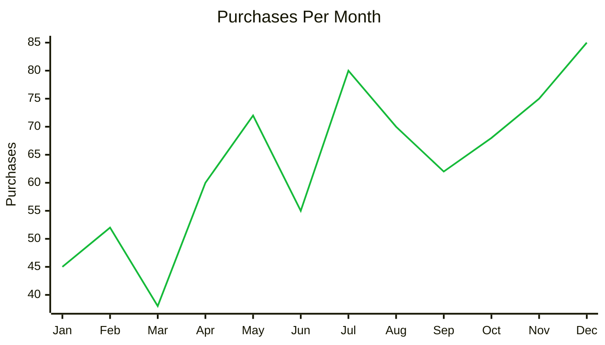

[^1]: This is the first footnote.
[^note]: This is a named footnote with **Markdown** inside.

```mermaid

---
config:
    xyChart:
        width: 700
        height: 400
    themeVariables:
        xyChart:
            plotColorPalette: "#15ba39"
---
xychart-beta
    title "Purchases Per Month"
    x-axis [Jan, Feb, Mar, Apr, May, Jun, Jul, Aug, Sep, Oct, Nov, Dec]
    y-axis "Purchases"
    line [45, 52, 38, 60, 72, 55, 80, 70, 62, 68, 75, 85]

```

[^1]: This is the first footnote.
[^note]: This is a named footnote with **Markdown** inside.
